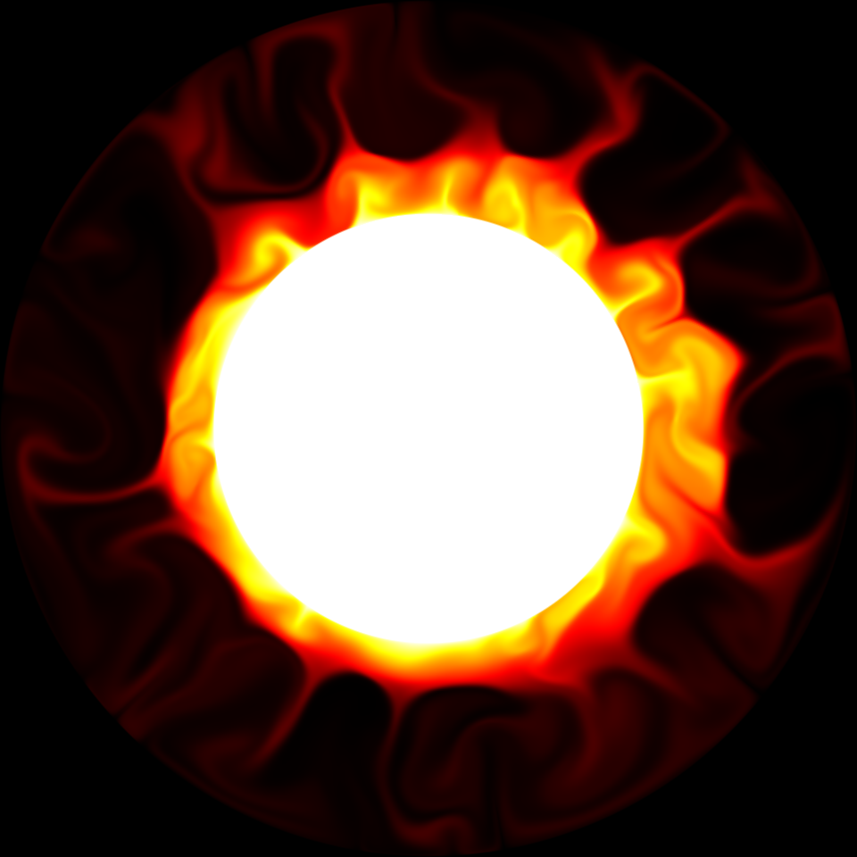

# Interactive Earth



Interactive Earth is a teaching tool for demonstrating mantle convection and its dependence on Rayleigh number.
It enables a mantle convection model to be run much more quickly than the codes typically used in research.
It solves the same governing equations, but makes comprimises for accuracy for the sake of achieving speed.
This speed enables the code to be very responsive to user input.

The simulations can be run in a browser without running any local code [here](http://ian-r-rose.angithub.io/interactive_earth/thermal_hires.html).

More about the project can be found [here](http://ian-r-rose.github.io/interactive_earth/about.html).

An introduction to the underlying science can be found [here](http://ian-r-rose.github.io/interactive_earth/explanation.html).

## Compiling on Ubuntu Linux
- Install ```fftw3```, ```SDL2```, and ```GLEW``` using ```apt-get```
- Rename ```Makefile.linux``` to ```makefile```
- Run ```make``` on the command line to compile the project
- run the program by typing its path and name in the command line: ```./interactive_earth```

## Compiling on a Mac
- brew install the following dependencies: ```fftw3```, ```SDL2```, ```GLEW```
- rename ```Makefile.osx``` to ```makefile```
- run the command ```make``` in the command line
- run the program by typing its path and name in the command line: ```./interactive_earth```

## Compiling to Javascript

Interactive Earth may be run in the web browser by compiling it to Javascript
using [emscripten](http://kripken.github.io/emscripten-site).
This takes a bit more work, since you must compile ```SDL2``` and ```fftw3``` manually as well,
but can be done. The finished product can be seen [here](http://ian-r-rose.github.io/interactive_earth/index.html).

## User input
With the simulation running, the user can make the following changes:
- put in positive temperature anomalies (add heat) by clicking
- put in negative thermal anomalies (remove heat) by right-clicking
- change the Rayleigh number (the vigor of convection) by scrolling
- press space to pause the simulation. while it is paused one can click to add earthquakes.

## Changing simulation behavior for advanced users
The behavior of the simulation can be modified by changing parameters within the upper part of the main.cpp file. The parameters that readily exposed for being modified include:
- the resolution of the simulation (and thereby how quickly it runs)
- whether or not to do a true polar wander (TPW) calculation
- whether to included a chemical field
- whether to render the simulation with flattened with an equatorial bulge
